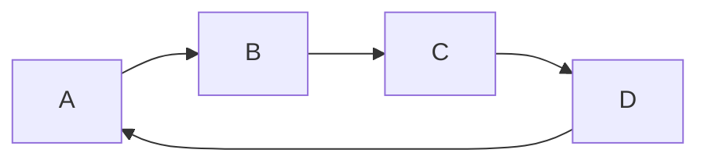

## 介绍
轻量型标记语言。可以用来做笔记、书籍、网站、文件资料、演示文稿。
下面是[官方教程](https://markdown.com.cn/)

## 补充
1.  [画图参考](https://blog.csdn.net/lis_12/article/details/80693975)
本质上还是代码块，标注为mermaid就可
```
graph LR;
  A-->B
  B-->C
  C-->D
  D-->A
```


2. [转docx](https://liuyun16.github.io/tools/2018-2-24-atom-markdown-zotero/)
如果要插入文献，配合Zotero插件使用